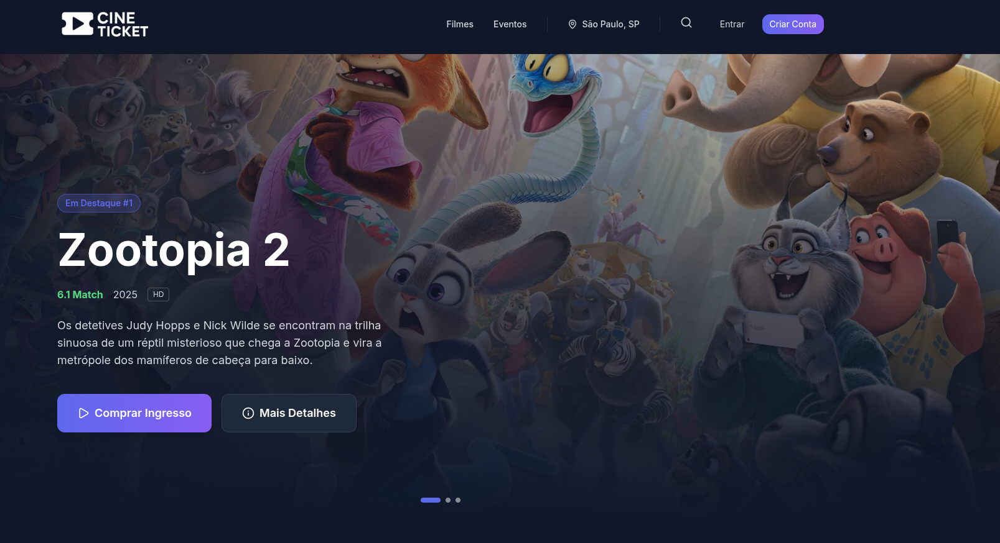
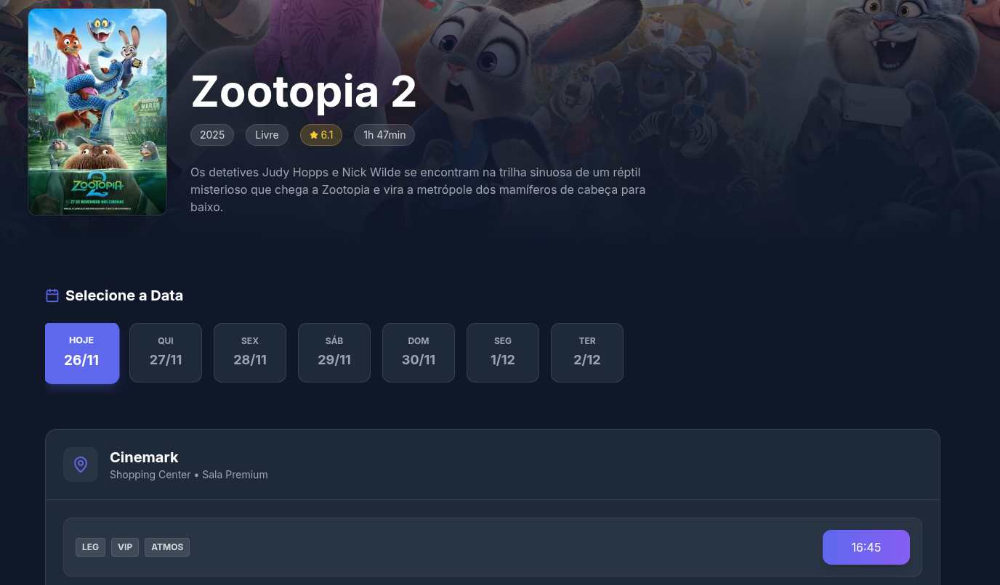
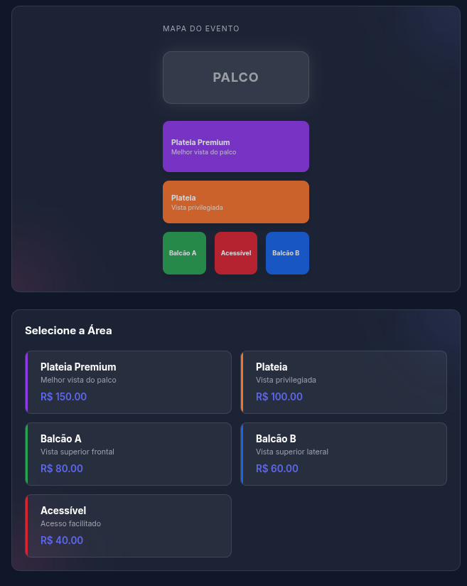
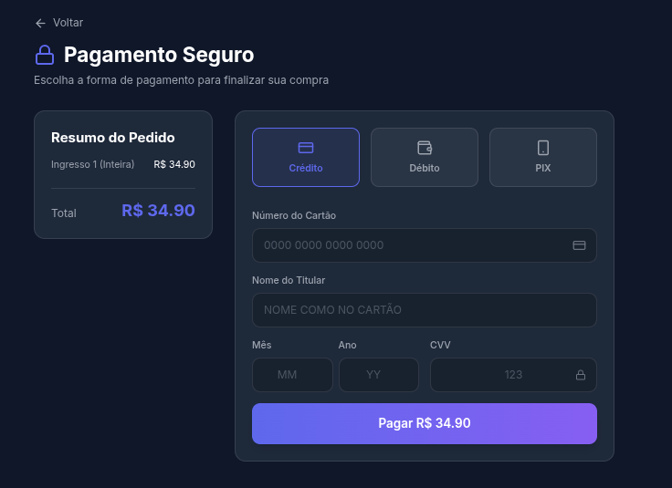

# CineTicket – Plataforma de Compra de Ingressos

**Projeto Integrador (PI)** – Universidade Tecnológica Federal do Paraná – Câmpus Campo Mourão (UTFPR-CM)  
**Curso:** Bacharelado em Ciência da Computação (BCC)

## Sobre o Projeto

CineTicket é uma plataforma web completa para compra de ingressos de cinema e eventos, desenvolvida com tecnologias modernas e arquitetura full-stack.

### Funcionalidades

- **Catálogo de Filmes**: Visualização de filmes em cartaz
- **Sistema de Ingressos**: Compra online com seleção de assentos
- **Autenticação**: Login e registro de usuários
- **Múltiplos Cinemas**: Suporte a diferentes locais
- **Interface Responsiva**: Design moderno e intuitivo
- **Filtros e Busca**: Encontre filmes e eventos facilmente

## Tecnologias

### Frontend
- **Next.js 14** - Framework React
- **React 18** - Biblioteca de interface
- **Tailwind CSS** - Framework de estilos
- **React Slick** - Carrossel de imagens
- **Context API** - Gerenciamento de estado

### Backend
- **Node.js** - Runtime JavaScript
- **Express.js** - Framework web
- **Prisma ORM** - Gerenciamento de banco de dados
- **SQLite** - Banco de dados
- **CORS** - Cross-origin resource sharing

### Infraestrutura
- **Docker** - Containerização
- **Docker Compose** - Orquestração de containers

## Como Executar

### Pré-requisitos
- Docker e Docker Compose instalados
- Navegador web moderno
- Variáveis de ambiente configuradas (opcional, mas recomendado):
  - `TMDB_API_KEY` e `TMDB_ACCESS_TOKEN` - Para sincronizar filmes do TMDB
  - `TICKETMASTER_API_KEY` (e opcionalmente `TICKETMASTER_API_SECRET`) - Para sincronizar eventos públicos do Ticketmaster (Brasil)

### Configuração de Ambiente

1. Navegue até a pasta do backend:
   ```bash
   cd backend
   ```

2. Copie o arquivo de exemplo:
   ```bash
   cp .env.example .env
   ```

3. Edite o arquivo `.env` com suas chaves de API.

### Execução 
```bash
# Clone o repositório
git clone <https://github.com/kalil03/Cine-Ticket.git>
cd Cine-Ticket

# Execute com Docker
docker compose -f docker-compose.dev.yml up --build

# Em outro terminal, popular o banco (seed) e sincronizar catálogos
docker compose exec backend npm run seed

# Ou sincronizar manualmente:
docker compose exec backend npm run sync:tmdb:max             # Sincronizar filmes do TMDB
docker compose exec backend npm run sync:ticketmaster:events  # Sincronizar eventos do Ticketmaster

# Acesse a aplicação
# Frontend: http://localhost:3000
# Backend:  http://localhost:3001
```
### Limpar Container e BD 
```bash
docker compose down -v
docker system prune -f

# Resetar banco dentro do container backend
docker compose exec backend npx prisma migrate reset --force
```
## API Endpoints

### Autenticação
- `POST /auth/login` - Login de usuário
- `POST /auth/register` - Registro de usuário

### Filmes
- `GET /movies` - Listar filmes
- `POST /movies` - Criar filme
- `GET /tmdb/popular` - Filmes populares do TMDB
- `GET /tmdb/search` - Buscar filmes no TMDB
- `POST /movies/sync-tmdb` - Sincronizar filme do TMDB

### Eventos
- `GET /events` - Listar eventos do banco de dados
- `GET /ticketmaster/events` - Listar eventos públicos da Ticketmaster (Brasil)
- `GET /ticketmaster/event/:id` - Detalhes de um evento Ticketmaster
- `POST /events/sync-ticketmaster` - Sincronizar evento do Ticketmaster para o banco local

### Cinemas
- `GET /cinemas` - Listar cinemas
- `POST /cinemas` - Criar cinema

### Sessões
- `GET /sessions` - Listar sessões
- `POST /sessions` - Criar sessão

### Ingressos
- `POST /purchase` - Comprar ingresso


## Arquitetura

```
┌─────────────────┐    ┌─────────────────┐    ┌─────────────────┐
│   Frontend      │    │   Backend       │    │   Database      │
│   (Next.js)     │◄──►│   (Express)     │◄──►│   (SQLite)      │
│   Port: 3000    │    │   Port: 3001    │    │   (Prisma)      │
└─────────────────┘    └─────────────────┘    └─────────────────┘
```
## Demonstração

### Home Page


### Detalhes do Filme e Sessões


### Eventos


### Pagamento


### Em Alta


## Equipe

- **Gabriel Dias**
- **João Pedro** 
- **Kalil**

## Licença
Este projeto está sob a licença MIT.

---

**🎬 CineTicket** - Sua plataforma completa para compra de ingressos!

